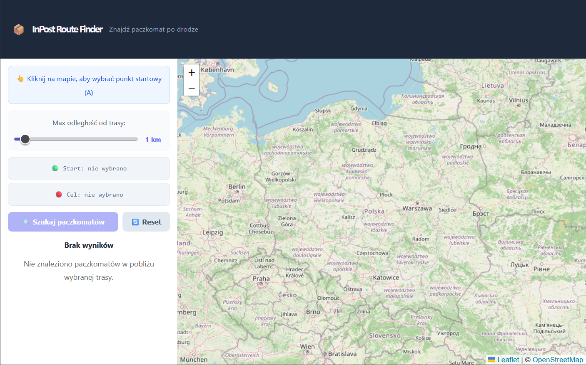
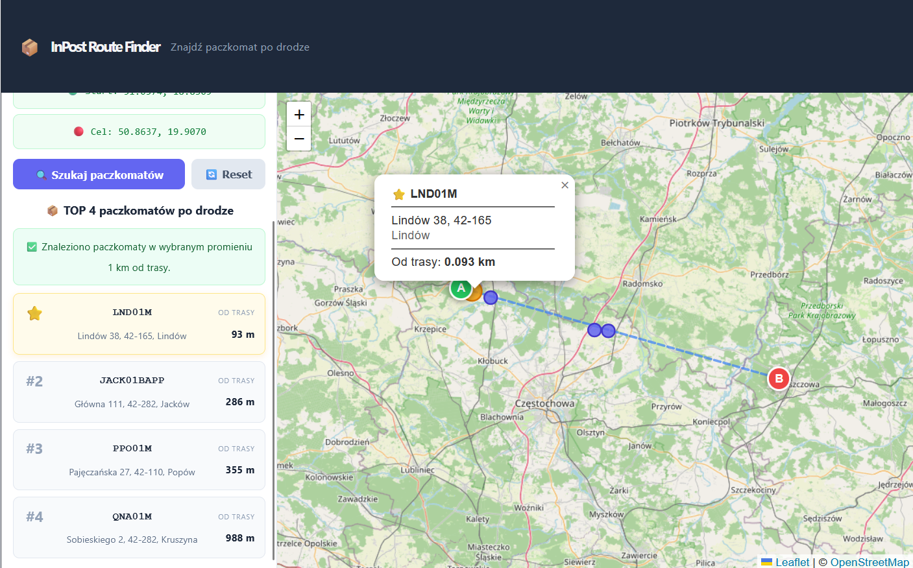

# InPost Route Finder

A web application that helps users find InPost parcel lockers located close to a selected route.

Instead of searching only for the nearest parcel locker to a single location, this project focuses on a more practical everyday use case: finding a locker that is already on the user's way.

The user selects a start point and a destination on the map. The backend fetches real parcel point data from the InPost Global Points API, processes the results, and returns the best lockers located near the selected route.

---

## Features

- Interactive map interface
- Selecting a start point and destination directly on the map
- Fetching real parcel point data from the InPost Global Points API
- Finding parcel lockers located near the selected route
- Ranking lockers by distance from the route
- Returning the top matching lockers sorted by distance from the route
- Showing locker details such as name, address and distance from route
- Automatic wider search when no lockers are found in the initial search corridor
- Backend validation for coordinates, distance and request parameters

---

## Screenshots

Screenshots are stored in:

```text
docs/screenshots/
```

### Map view



### Search results



---

## Tech stack

### Backend

- Java 21
- Spring Boot
- Maven
- Spring Web
- Lombok
- InPost Global Points API

### Frontend

- React
- TypeScript
- Vite
- Leaflet
- React Leaflet
- Axios

---

## Project structure

```text
route-finder/
├── backend/
│   ├── mvnw
│   ├── mvnw.cmd
│   ├── pom.xml
│   └── src/
│       └── main/
│           ├── java/com/inpost/routefinder/
│           │   ├── client/
│           │   ├── controller/
│           │   ├── model/
│           │   ├── service/
│           │   ├── util/
│           │   └── RouteFinderApplication.java
│           └── resources/
│               └── application.properties
├── frontend/
│   ├── package.json
│   ├── vite.config.ts
│   ├── index.html
│   └── src/
│       ├── components/
│       ├── services/
│       ├── types/
│       ├── App.tsx
│       └── main.tsx
├── docs/
│   └── screenshots/
├── README.md
└── .gitignore
```

---

## How to run the project

The application consists of two parts:

1. Backend running on `http://localhost:8080`
2. Frontend running on `http://localhost:3000`

Both need to be started separately.

---

## Running the backend

Go to the backend directory:

```bash
cd backend
```

Run the Spring Boot application.

On Windows:

```bash
mvnw.cmd spring-boot:run
```

On macOS/Linux:

```bash
./mvnw spring-boot:run
```

The backend should start on:

```text
http://localhost:8080
```

---

## Running the frontend

Open a second terminal and go to the frontend directory:

```bash
cd frontend
```

Install dependencies:

```bash
npm install
```

Start the development server:

```bash
npm run dev
```

The frontend should start on:

```text
http://localhost:3000
```

Open the application in your browser:

```text
http://localhost:3000
```

---

## Building the frontend

To create a production build of the frontend:

```bash
cd frontend
npm run build
```

The production files will be generated in:

```text
frontend/dist/
```

To preview the production build locally:

```bash
npm run preview
```

---

## API used

The project uses the InPost Global Points API as the primary data source:

```http
GET https://api-global-points.easypack24.net/v1/points
```

The API provides information about parcel pick-up points, including:

- point name
- location coordinates
- address details
- available functions
- point type
- opening hours and availability data

---

## Backend endpoint

The frontend communicates with the backend through the following endpoint:

```http
GET /api/route-lockers
```

Example request:

```http
GET /api/route-lockers?startLat=52.2297&startLng=21.0122&endLat=52.4064&endLng=16.9252&maxDistanceKm=1
```

Example parameters:

| Parameter | Description |
|---|---|
| `startLat` | Latitude of the route start point |
| `startLng` | Longitude of the route start point |
| `endLat` | Latitude of the route destination |
| `endLng` | Longitude of the route destination |
| `maxDistanceKm` | Maximum distance from the route in kilometers |

The selected route must not be longer than 300 km.

Example response structure:

```json
{
  "lockers": [
    {
      "id": "example-locker-id",
      "name": "Parcel locker name",
      "address": "Street name, City",
      "latitude": 52.2297,
      "longitude": 21.0122,
      "distanceFromRouteKm": 0.34
    }
  ],
  "usedExpandedSearch": false,
  "message": "Found lockers near the selected route."
}
```

---

## How it works

The application treats the selected route as a straight line between the start point and the destination.

The backend then:

1. Receives start and destination coordinates from the frontend.
2. Checks whether the selected route is within the 300 km limit.
3. Validates the input parameters.
4. Samples several points along the selected route.
5. Queries the InPost Global Points API for parcel points near those sampled locations.
6. Removes duplicated points returned from multiple API calls.
7. Calculates the distance of each locker from the selected route.
8. Filters lockers by the selected maximum distance.
9. Sorts lockers by distance from the route.
10. Returns the best matching results to the frontend.

If no lockers are found within the initial search distance, the backend can perform a wider search and inform the frontend that expanded search was used.

---

## Main technical decisions

### Separate frontend and backend

The project is split into two independent parts:

- Spring Boot backend for API communication and route-based filtering
- React frontend for map interaction and displaying results

This keeps responsibilities clear and makes the application easier to understand.

### Backend as an API wrapper

The frontend does not call the InPost API directly. Instead, the backend acts as a small API layer.

This allows the backend to:

- validate requests
- call the external API
- normalize the response
- remove duplicates
- calculate distances
- return only data needed by the frontend

### Route as a straight line

The route is currently simplified to a straight line between two selected points.

This was a deliberate scope decision. The goal was not to build a full navigation system, but to solve the core problem of finding parcel lockers near a chosen direction of travel.

### Focused scope

The project does not try to use every field returned by the InPost API.

Instead, it focuses on a useful subset of data:

- locker name
- location
- address
- distance from route

This keeps the application clear and practical.

---

## Limitations

- The route is currently represented as a straight line, not a real road route.
- The application does not currently support address search or geocoding.
- The user selects points manually on the map.
- The maximum supported route length is 300 km.

---

## Possible future improvements

- Add address search and geocoding
- Use a routing API to follow real roads instead of a straight line
- Add automated backend tests

---

## How to use the application

1. Start the backend.
2. Start the frontend.
3. Open `http://localhost:3000`.
4. Select the start point on the map.
5. Select the destination point on the map.
6. Choose or keep the maximum distance from the route.
7. Search for parcel lockers.
8. Review the best matching lockers displayed on the map and in the results list.

---
